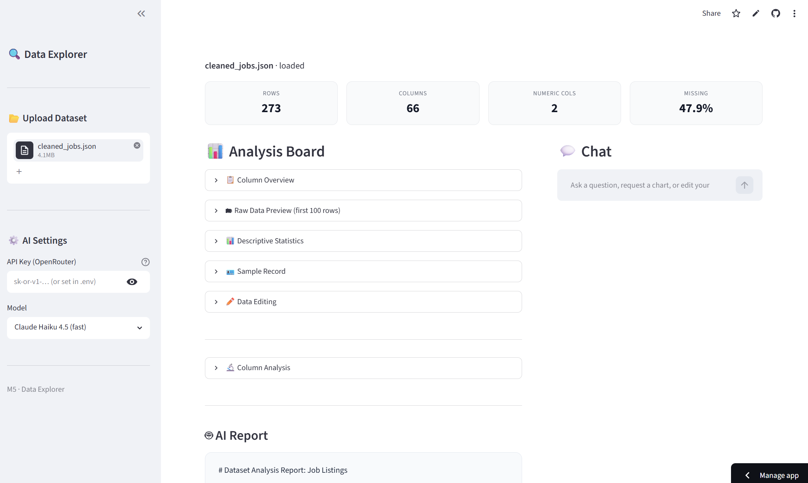
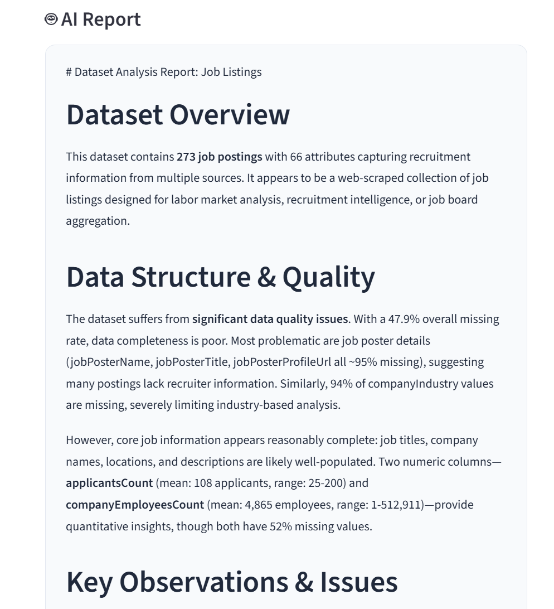
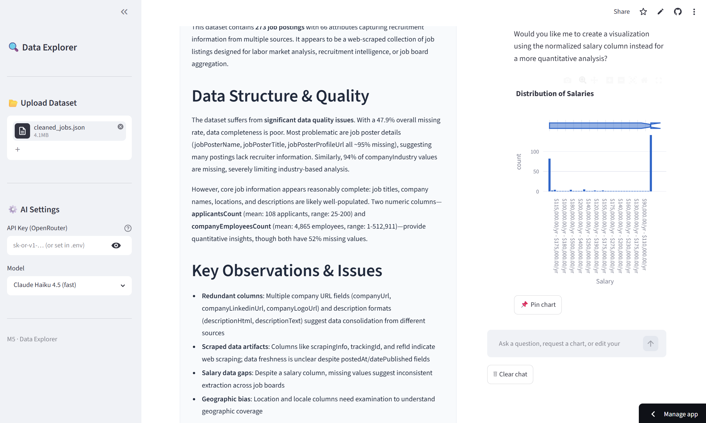
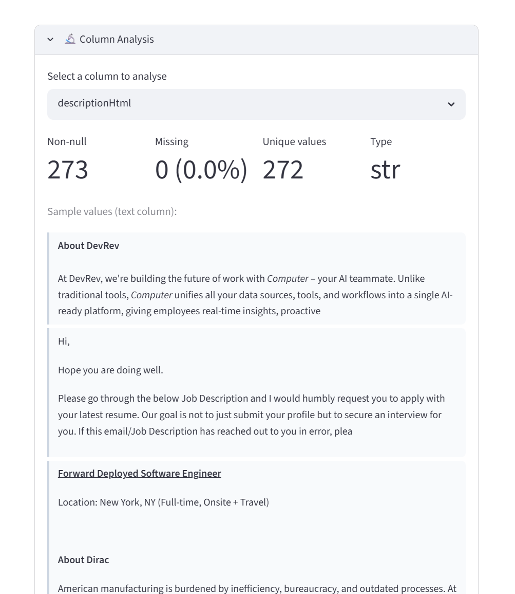

# 🔍 Data Explorer — AI-Powered Dataset Analysis Tool

**Live Demo:** [data-explorer-ai-dxn2ofp7nwinuvadk23bdu.streamlit.app](https://data-explorer-ai-dxn2ofp7nwinuvadk23bdu.streamlit.app)

A web application that lets you upload any dataset and instantly understand it — through automated AI reports, interactive visualizations, conversational querying, column-level deep dives, and an autonomous analysis agent.

Built as a personal tool to solve a real problem: when researching Forward Deployed Engineer roles, reading raw JSON files was tedious and slow. This app turns any dataset into something you can actually explore and reason about.

---

## ✨ Features

**📊 Data Overview**
- Upload CSV, JSON, or Excel files (up to 200 MB)
- Instant summary stats: row count, column count, missing rate
- Column overview table with types, non-null counts, and sample values
- Interactive descriptive statistics with per-column toggle (auto-filters out ID and boolean columns)
- Sample record viewer with expandable long-text fields

**🤖 AI Analysis Report**
- Automatically generates a 200–300 word dataset interpretation report on upload
- Covers dataset purpose, data quality issues, key patterns, and suggested analysis questions
- Powered by Claude via OpenRouter API with streaming output

**🔬 Column Analysis**
- Select any column for a focused AI deep dive
- Auto-adapts analysis by column type: numeric (distributions, skewness), categorical (top values), free text (sample patterns), or nested objects
- Inline chart preview (histogram or bar chart) before running AI analysis

**💬 Conversational Chat**
- Multi-turn chat grounded in your dataset's structure
- AI generates and executes Pandas code for precise data queries
- AI generates Plotly charts on request — rendered inline in the chat
- Natural language data editing: "Delete all rows where salary is null"
- Pin any chart or table from chat to the Analysis Board

**🤖 Agent Mode**
- Autonomous multi-step analysis: give a goal, Agent plans and executes up to 10 steps
- 6 built-in tools: inspect dataset, get column stats, run Pandas queries, create charts, filter data, summarize findings
- Each step is shown in real time with expandable tool call details
- Charts generated by Agent can be pinned to the Analysis Board
- Uses OpenRouter tool-calling API (OpenAI-compatible function calling format)

**📈 AI-Recommended Visualizations**
- Automatically recommends 3–4 relevant charts based on dataset structure
- Renders interactive Plotly charts (bar, histogram, scatter, box, pie)
- Each chart includes an AI-written rationale

**✏️ Data Editing & Export**
- Delete rows manually or via quick filters (drop nulls, drop duplicates)
- Add new rows
- Export edited dataset as CSV, JSON, or Excel

**⚙️ Configurable AI Settings**
- Bring your own OpenRouter API key (or set via `.env`)
- Choose model: Claude Haiku (fast), Claude Sonnet (smart), GPT-4o Mini, or Llama 3.3 70B (free)

---

## 📸 Screenshots

### Analysis Board + Chat


### AI Report


### Chat-generated Chart


### Column Analysis


---

## 🛠 Tech Stack

| Layer | Technology |
|---|---|
| Frontend / App | Streamlit |
| Data processing | Pandas |
| Visualization | Plotly Express |
| AI integration | Claude via OpenRouter (OpenAI-compatible SDK) |
| Agent tool calling | OpenAI function-calling format via OpenRouter |
| File parsing | Pandas + openpyxl |
| Environment config | python-dotenv |
| Deployment | Streamlit Community Cloud |

---

## 🚀 Run Locally

**1. Clone the repo**
```bash
git clone https://github.com/ZQ-LLL/data-explorer-ai.git
cd data-explorer-ai
```

**2. Create and activate a virtual environment**
```bash
python -m venv venv
venv\Scripts\activate      # Windows
# source venv/bin/activate  # Mac/Linux
```

**3. Install dependencies**
```bash
pip install -r requirements.txt
```

**4. Set up your API key**

Create a `.env` file in the project root:
```
OPENROUTER_API_KEY="your-key-here"
```

Get a free key at [openrouter.ai](https://openrouter.ai). Several models (including Llama 3.3 70B) are available for free.

**5. Run the app**
```bash
streamlit run app.py
```

Open [http://localhost:8501](http://localhost:8501) in your browser.

---

## 📁 Project Structure

```
data-explorer-ai/
├── app.py                  # Main application — UI layout and page routing only
├── utils/
│   ├── __init__.py
│   ├── parser.py           # File parsing, DataFrame metadata, sampling, export
│   ├── ai.py               # AI client setup, prompt builders, API callers
│   ├── charts.py           # Plotly chart rendering from AI spec dicts
│   └── agent.py            # Agent loop, tool definitions, tool execution
├── screenshots/            # README screenshots
├── requirements.txt
├── .env                    # API key (not committed)
├── .gitignore
└── README.md
```

---

## 💡 Background

This project started from a practical frustration: while researching Forward Deployed Engineer roles, I was working with a large JSON dataset of job listings and found raw file inspection slow and unintuitive. I wanted a tool that could ingest any dataset and immediately surface what's in it — structure, quality issues, patterns — without writing ad-hoc scripts every time.

The result is a general-purpose data exploration assistant that works on any tabular dataset.

---

## 🗺 Roadmap / Future Ideas

- [ ] Agent context persistence across runs (currently each run starts fresh)
- [ ] Unit tests for parsing and AI prompt functions
- [ ] Independent column scroll in two-panel layout (requires React frontend)
- [ ] Nested column value formatting (`{}` → structured display)
- [ ] Multi-dataset comparison mode
- [ ] RAG pipeline for document-grounded analysis (planned for next project)

---

## 📄 License

MIT
